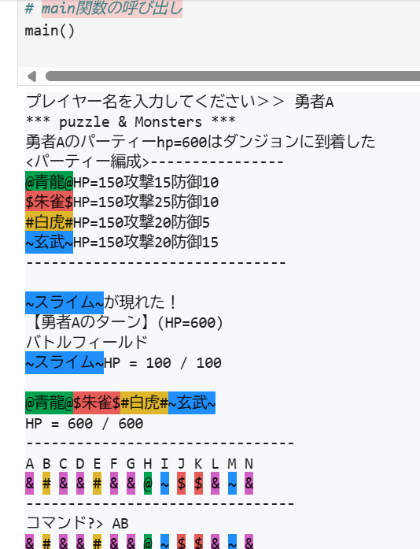
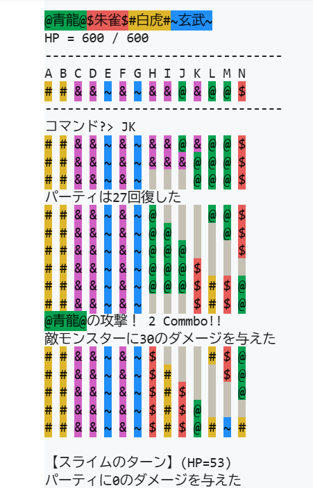
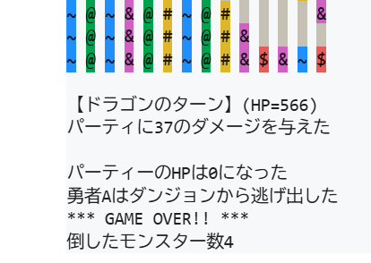

# puzmon
## Overview
'''
I made this game as the final project for the textbook "スッキリわかるpython入門". 
It is a CUI-based puzzle RPG that runs in the terminal. 
To play, you move the gems by entering two letters (A-N) to shift a range. 
If three or more matching gems line up, your party will attack the monster. 
Enjoy the game!
'''
## Code 
[puzmon.ipynb](https://github.com/iamthinking98-jpg/puzmon/blob/main/puzmon.ipynb)(Note: This is a Jupyter Notebook file.)
## How to Run
1.Download the puzmon.ipynb file.

2.Run it using Jupyter Notebook.

## Execution Proof

Here are screenshots of the game running in the terminal.

